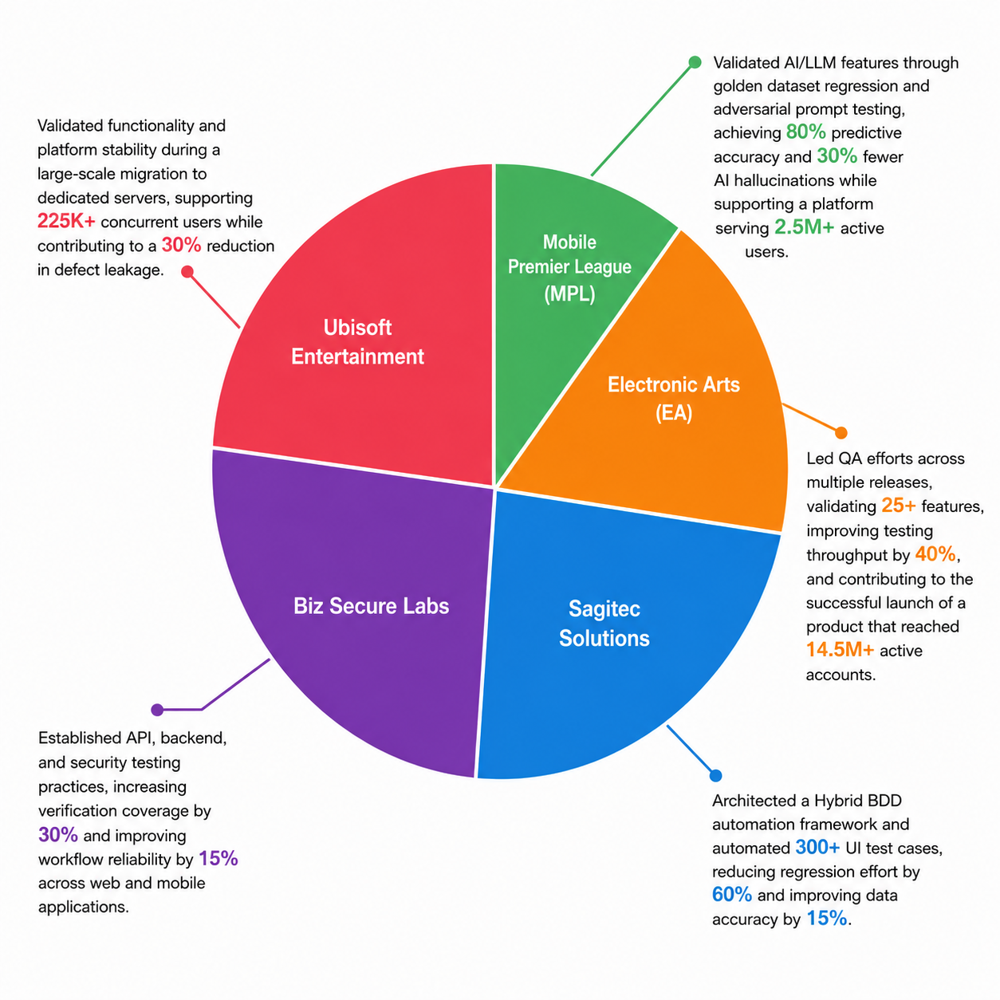

# 💫 About Me

Hi, I'm Omkar Deshpande 👋

Senior QA Engineer with 7+ years of experience in Quality Engineering, AI/LLM Testing, Test Automation, API Testing, Database Testing, and Mobile Testing across FinTech, Banking, Pension, Security, and Gaming domains.

# 💻 Tech Stack:
## 🚀 Test Automation

## 🎯 Quality Engineering

## 🤖 AI Quality Assurance

## 🛠️ Tools & Platforms

